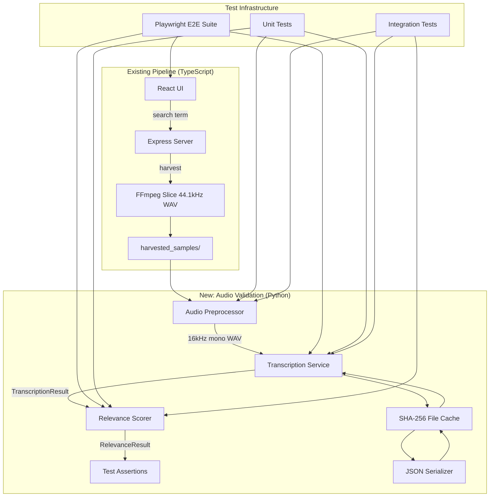

# Design Document: E2E Audio Validation

## Overview

This design describes the architecture for end-to-end audio validation in the Vox Harvester pipeline. The feature adds a Python-based audio preprocessing and transcription subsystem that validates harvested audio content against search intent. It consists of:

1. **Audio Preprocessor** — FFmpeg-based conversion of harvested WAV files to Whisper-compatible 16kHz mono format, with chunking for long files.
2. **Transcription Service** — Local Whisper inference wrapper producing structured `TranscriptionResult` objects with word-level timestamps.
3. **Relevance Scorer** — Stemmed token overlap comparison between transcripts and search terms.
4. **E2E Test Suite** — Playwright tests exercising the full pipeline from UI search through transcription validation.
5. **Test Harness** — Unit and integration tests for all transcription components.
6. **Serialization Layer** — JSON round-trip and pretty-print for `TranscriptionResult` objects.

The existing application is a TypeScript/Node.js server with a React frontend. The new audio validation subsystem lives in Python (using `openai-whisper`, `hypothesis`, `pytest`, and `playwright`), interfacing with the existing pipeline's WAV output in `harvested_samples/`.

## Architecture



### Design Decisions

1. **Python for the validation subsystem**: Whisper is a Python library; wrapping it in Python avoids cross-language subprocess overhead and gives direct access to word-level timestamps. The existing test suite already uses `pytest` and `hypothesis`.

2. **File-based interface**: The preprocessor reads from `harvested_samples/` and writes to a temp directory. No IPC protocol needed — the TypeScript server and Python validation share the filesystem.

3. **SHA-256 caching**: Transcription is expensive (~5-15s per file with `tiny` model). Caching by file content hash means repeated test runs skip inference. Cache is stored as JSON files in a configurable directory.

4. **Chunking with overlap**: Files >300s are split into 300s chunks with 5s overlap to avoid losing words at boundaries. Overlap deduplication happens at the stitching phase.

5. **Porter stemming for relevance**: Simple, deterministic, no external dependencies beyond NLTK's `PorterStemmer`. Good enough for English keyword matching without heavy NLP.

## Components and Interfaces

### Audio Preprocessor (`src/audio_validation/preprocessor.py`)

```python
from pathlib import Path
from dataclasses import dataclass

@dataclass
class PreprocessResult:
    """Result of audio preprocessing."""
    output_paths: list[Path]  # One path for short files, multiple for chunked
    sample_rate: int          # Always 16000
    channels: int             # Always 1
    bit_depth: int            # Always 16
    duration_seconds: float   # Total duration of source

class AudioPreprocessor:
    """Converts harvested WAV files to Whisper-compatible format."""

    def __init__(self, ffmpeg_path: str = "ffmpeg", output_dir: Path | None = None):
        ...

    def preprocess(self, source_path: Path) -> PreprocessResult:
        """Convert source WAV to 16kHz mono 16-bit PCM WAV.
        
        Segments files longer than 300s into chunks with 5s overlap.
        Raises FileNotFoundError if source doesn't exist.
        Raises ValueError if source contains invalid audio data.
        Preserves original file.
        """
        ...
```

### Transcription Service (`src/audio_validation/transcriber.py`)

```python
from pathlib import Path
from dataclasses import dataclass, field

@dataclass
class WordTimestamp:
    word: str
    start: float   # seconds
    end: float     # seconds
    confidence: float  # 0.0 to 1.0

@dataclass
class Segment:
    text: str
    start: float
    end: float
    words: list[WordTimestamp] = field(default_factory=list)

@dataclass
class TranscriptionResult:
    segments: list[Segment]
    language: str
    duration: float        # total audio duration in seconds
    model: str             # e.g., "tiny"

class TranscriptionService:
    """Local Whisper-based speech-to-text with caching."""

    def __init__(self, model_name: str = "tiny", cache_dir: Path | None = None):
        ...

    def transcribe(self, audio_path: Path) -> TranscriptionResult:
        """Transcribe a 16kHz WAV file using Whisper.
        
        Returns cached result if file content hash matches.
        Raises DependencyError if Whisper not installed.
        Raises InvalidAudioError if file is not valid WAV.
        Raises TimeoutError if inference exceeds 120s.
        """
        ...

    def _compute_hash(self, file_path: Path) -> str:
        """SHA-256 hash of file contents."""
        ...
```

### Relevance Scorer (`src/audio_validation/scorer.py`)

```python
@dataclass
class RelevanceResult:
    score: float        # 0.0 to 1.0
    is_relevant: bool   # score > threshold
    matched_tokens: list[str]
    search_tokens: list[str]
    transcript_tokens: list[str]

class RelevanceScorer:
    """Computes relevance between transcript and search term."""

    def __init__(self, threshold: float = 0.3):
        ...

    def score(self, transcript: TranscriptionResult, search_term: str) -> RelevanceResult:
        """Compute stemmed token overlap relevance score.
        
        Raises ValueError if search_term produces no valid tokens after normalization.
        """
        ...

    def _normalize_and_stem(self, text: str) -> list[str]:
        """Lowercase, remove non-alphanumeric, split, Porter stem."""
        ...
```

### JSON Serializer (`src/audio_validation/serializer.py`)

```python
class TranscriptionSerializer:
    """JSON serialization/deserialization for TranscriptionResult."""

    @staticmethod
    def to_json(result: TranscriptionResult) -> str:
        """Serialize to JSON with ≤6 decimal places for floats."""
        ...

    @staticmethod
    def from_json(json_str: str) -> TranscriptionResult:
        """Deserialize JSON to TranscriptionResult.
        
        Raises ParseError with field name and reason on failure.
        """
        ...

    @staticmethod
    def pretty_print(result: TranscriptionResult) -> str:
        """Format as human-readable text: [<start>s-<end>s] <text> per segment."""
        ...
```

### E2E Test Configuration (`tests/e2e/conftest.py`)

```python
import pytest
from pathlib import Path

@pytest.fixture
def test_env(tmp_path):
    """Configure isolated test environment."""
    return {
        "TEST_DB_FILE": str(tmp_path / "test_db.json"),
        "TEST_AUDIO_DIR": str(tmp_path / "test_audio"),
    }
```

## Data Models

### TranscriptionResult Schema (JSON)

```json
{
  "segments": [
    {
      "text": "Your time is limited",
      "start": 0.0,
      "end": 2.5,
      "words": [
        {"word": "Your", "start": 0.0, "end": 0.3, "confidence": 0.95},
        {"word": "time", "start": 0.35, "end": 0.6, "confidence": 0.98},
        {"word": "is", "start": 0.65, "end": 0.75, "confidence": 0.92},
        {"word": "limited", "start": 0.8, "end": 1.2, "confidence": 0.96}
      ]
    }
  ],
  "language": "en",
  "duration": 5.5,
  "model": "tiny"
}
```

### Cache File Naming

Cache files are stored as `{sha256_hex}.json` in the cache directory. The cache key is the full SHA-256 hex digest of the raw audio file bytes.

### RelevanceResult Structure

| Field | Type | Description |
|-------|------|-------------|
| `score` | float | 0.0–1.0, ratio of matched stemmed tokens to total search tokens |
| `is_relevant` | bool | `score > threshold` |
| `matched_tokens` | list[str] | Stemmed tokens found in both transcript and search term |
| `search_tokens` | list[str] | All stemmed tokens from the search term |
| `transcript_tokens` | list[str] | All stemmed tokens from the transcript |

### PreprocessResult Structure

| Field | Type | Description |
|-------|------|-------------|
| `output_paths` | list[Path] | Ordered list of output WAV file paths |
| `sample_rate` | int | Always 16000 |
| `channels` | int | Always 1 |
| `bit_depth` | int | Always 16 |
| `duration_seconds` | float | Total duration of source file |


## Correctness Properties

*A property is a characteristic or behavior that should hold true across all valid executions of a system — essentially, a formal statement about what the system should do. Properties serve as the bridge between human-readable specifications and machine-verifiable correctness guarantees.*

### Property 1: Preprocessor format invariant

*For any* valid audio file at any sample rate (8kHz–96kHz), any channel count, and any bit depth, the Audio Preprocessor SHALL produce output that is exactly 16kHz, mono, 16-bit PCM WAV — regardless of the input format.

**Validates: Requirements 1.1, 1.2**

### Property 2: Preprocessor chunking correctness

*For any* audio file with duration exceeding 300 seconds, the Audio Preprocessor SHALL produce N chunks where each chunk is at most 300 seconds, consecutive chunks overlap by exactly 5 seconds, chunks are returned in chronological order, and the total coverage (accounting for overlaps) equals the source duration within 0.1 seconds tolerance.

**Validates: Requirements 1.4**

### Property 3: Preprocessor preserves source file

*For any* valid audio file, after preprocessing completes (successfully or with error), the source file's content (SHA-256 hash) SHALL be identical to its content before the operation was invoked.

**Validates: Requirements 1.7**

### Property 4: Preprocessor error on invalid input

*For any* file path that does not exist, the preprocessor SHALL raise an error containing that file path. *For any* file containing random non-audio bytes, the preprocessor SHALL raise a decode error indicating the file could not be decoded.

**Validates: Requirements 1.5, 1.6**

### Property 5: TranscriptionResult structural validity

*For any* TranscriptionResult object produced by the Transcription Service, all segments SHALL have start < end, all WordTimestamp objects SHALL have start < end and 0.0 ≤ confidence ≤ 1.0, and the required fields (segments, language, duration, model) SHALL all be present with correct types.

**Validates: Requirements 2.2, 2.3**

### Property 6: Transcription cache idempotence

*For any* audio file, transcribing it twice SHALL return an identical TranscriptionResult, and the underlying Whisper inference SHALL be invoked exactly once (the second call returns from cache).

**Validates: Requirements 2.6**

### Property 7: Invalid WAV rejection without Whisper invocation

*For any* file that is not a valid WAV file (random bytes, wrong header, zero-length), the Transcription Service SHALL raise a format error indicating the file path and problem nature, and SHALL NOT invoke Whisper inference.

**Validates: Requirements 2.7**

### Property 8: Relevance score formula correctness

*For any* TranscriptionResult and any non-empty search term (that produces at least one token after normalization), the Relevance Score SHALL equal |stemmed_search_tokens ∩ stemmed_transcript_tokens| / |stemmed_search_tokens|, the result SHALL be in [0.0, 1.0], and `is_relevant` SHALL equal `score > threshold`.

**Validates: Requirements 3.1, 3.3, 3.4, 3.5**

### Property 9: Normalization idempotence and constraints

*For any* input string, the normalization function SHALL produce output that is: (a) entirely lowercase, (b) contains only alphabetic stemmed tokens, (c) idempotent — normalizing the output again produces the same result.

**Validates: Requirements 3.2**

### Property 10: Empty search term rejection

*For any* string that contains no alphanumeric characters after normalization (all punctuation, all whitespace, empty string), the Relevance Scorer SHALL raise an error indicating no valid tokens were produced.

**Validates: Requirements 3.6**

### Property 11: Serialization round-trip preservation

*For any* valid TranscriptionResult object, serializing to JSON then deserializing SHALL produce an object where all string and integer fields are identical, and all floating-point fields (timestamps, confidence, duration) match within a tolerance of 1e-6.

**Validates: Requirements 8.2, 8.3**

### Property 12: Serialization float precision

*For any* valid TranscriptionResult object, serializing to JSON SHALL produce a string where every floating-point value has at most 6 decimal places.

**Validates: Requirements 8.1**

### Property 13: Pretty-print format correctness

*For any* TranscriptionResult with N segments (N ≥ 1), the pretty-print output SHALL contain exactly N lines, each matching the pattern `[<start>s-<end>s] <text>` where start and end are formatted to 1 decimal place. For empty segments, the output SHALL be an empty string.

**Validates: Requirements 8.5, 8.6**

### Property 14: Deserialization error reporting

*For any* JSON string that is malformed or missing required TranscriptionResult fields, the deserializer SHALL raise a ParseError that includes the name of the first missing or invalid field and whether the failure is due to absence, wrong type, or invalid value.

**Validates: Requirements 8.4**

### Property 15: Segment stitching chronological order and no duplication

*For any* set of chunked transcription results from overlapping audio segments, the stitched output SHALL have segments in strictly chronological order (each segment's start ≥ previous segment's end), no time gap exceeding 5 seconds between consecutive segment boundaries, and no duplicate words in overlap regions.

**Validates: Requirements 7.4**

## Error Handling

### Error Hierarchy

```python
class AudioValidationError(Exception):
    """Base error for the audio validation subsystem."""
    pass

class PreprocessError(AudioValidationError):
    """Raised when audio preprocessing fails."""
    def __init__(self, message: str, file_path: Path):
        self.file_path = file_path
        super().__init__(f"{message}: {file_path}")

class DependencyError(AudioValidationError):
    """Raised when a required dependency is missing."""
    def __init__(self, dependency_name: str, reason: str):
        self.dependency_name = dependency_name
        super().__init__(f"Missing dependency '{dependency_name}': {reason}")

class InvalidAudioError(AudioValidationError):
    """Raised when input file is not valid audio."""
    def __init__(self, file_path: Path, reason: str):
        self.file_path = file_path
        self.reason = reason
        super().__init__(f"Invalid audio '{file_path}': {reason}")

class TranscriptionTimeoutError(AudioValidationError):
    """Raised when Whisper inference exceeds timeout."""
    def __init__(self, file_path: Path, elapsed_seconds: float):
        self.file_path = file_path
        self.elapsed_seconds = elapsed_seconds
        super().__init__(f"Transcription timeout after {elapsed_seconds:.1f}s: {file_path}")

class ParseError(AudioValidationError):
    """Raised when JSON deserialization fails."""
    def __init__(self, field_name: str, reason: str):
        self.field_name = field_name
        self.reason = reason  # "absence" | "wrong_type" | "invalid_value"
        super().__init__(f"Parse error on field '{field_name}': {reason}")

class RelevanceError(AudioValidationError):
    """Raised when relevance scoring cannot proceed."""
    pass
```

### Error Strategy

| Component | Error Condition | Response |
|-----------|----------------|----------|
| Preprocessor | File not found | `PreprocessError` with file path |
| Preprocessor | Corrupt/invalid audio | `PreprocessError` with decode reason |
| Preprocessor | FFmpeg not available | `DependencyError("ffmpeg", reason)` |
| Transcriber | Whisper not installed | `DependencyError("openai-whisper", reason)` |
| Transcriber | Invalid WAV format | `InvalidAudioError` with path and reason |
| Transcriber | Timeout (>120s) | `TranscriptionTimeoutError` with path and elapsed |
| Serializer | Malformed JSON | `ParseError` with field name and reason |
| Scorer | Empty search term | `RelevanceError` with explanation |
| E2E Tests | Pipeline step failure | Assertion failure + screenshot capture |

### Timeout Handling

- Transcription timeout: 120 seconds, enforced via `signal.alarm` (Unix) or threading timer (Windows).
- E2E test timeout: 120 seconds per test via `pytest-timeout`.
- Integration test timeout: 120 seconds per test, marked failed on exceed.

## Testing Strategy

### Test Library Choices

- **Property-based testing**: `hypothesis` (already in use in the project)
- **Unit/integration tests**: `pytest`
- **E2E tests**: `playwright` with `pytest-playwright`
- **Mocking**: `unittest.mock` (stdlib)
- **Coverage**: `pytest-cov` with 75% minimum (enforced in `pyproject.toml`)

### Property-Based Tests

Property-based tests use the `hypothesis` library with `@settings(max_examples=100)` minimum. Each test is tagged with its design property reference.

**Tag format**: `Feature: e2e-audio-validation, Property {number}: {title}`

Tests are organized in:
- `tests/test_preprocessor_properties.py` — Properties 1–4
- `tests/test_transcriber_properties.py` — Properties 5–7
- `tests/test_scorer_properties.py` — Properties 8–10
- `tests/test_serializer_properties.py` — Properties 11–14
- `tests/test_stitching_properties.py` — Property 15

### Unit Tests

Focused on specific examples and edge cases not covered by property generators:
- `tests/test_preprocessor_unit.py` — Format conversion with known fixtures, short file edge case
- `tests/test_transcriber_unit.py` — Whisper dependency error, timeout, silence input
- `tests/test_scorer_unit.py` — Boundary values (0.0, 1.0, partial), threshold configuration
- `tests/test_serializer_unit.py` — Empty segments edge case, known JSON fixtures

### Integration Tests

Exercise the full pipeline with real Whisper (skipped if not installed):
- `tests/test_integration_pipeline.py` — Preprocess → transcribe → score with known fixtures
- Noisy audio fixture handling
- Segmented audio stitching with >300s fixture
- Ground-truth relevance score validation

### E2E Tests

Playwright tests in `tests/e2e/`:
- `tests/e2e/test_pipeline_e2e.py` — Full UI → harvest → transcribe → score flow
- Parametrized with 3+ search terms (speech, interview, lecture)
- Mocked API responses for deterministic execution
- Screenshot capture on failure
- Isolated via `TEST_DB_FILE` and `TEST_AUDIO_DIR` environment variables

### Test Fixtures

Located in `tests/fixtures/`:
- `speech_5s.wav` — 5-second clear speech sample (44.1kHz mono 16-bit)
- `speech_30s.wav` — 30-second speech for integration tests
- `noisy_speech.wav` — Speech with background noise
- `silence.wav` — Pure silence (5 seconds)
- `long_speech_310s.wav` — >300s file for chunking tests (can be generated synthetically)
- `corrupt.wav` — Invalid WAV header
- `not_audio.txt` — Non-audio file for format rejection tests
- `expected_transcript.json` — Ground-truth transcription for validation

### Hypothesis Strategies

Custom strategies for generating test data:

```python
from hypothesis import strategies as st

# Valid TranscriptionResult objects
word_timestamps = st.builds(
    WordTimestamp,
    word=st.text(min_size=1, max_size=20, alphabet=st.characters(whitelist_categories=("L",))),
    start=st.floats(min_value=0.0, max_value=300.0, allow_nan=False, allow_infinity=False),
    end=st.floats(min_value=0.01, max_value=300.0, allow_nan=False, allow_infinity=False),
    confidence=st.floats(min_value=0.0, max_value=1.0, allow_nan=False, allow_infinity=False),
)

segments = st.builds(
    Segment,
    text=st.text(min_size=1, max_size=200),
    start=st.floats(min_value=0.0, max_value=300.0, allow_nan=False, allow_infinity=False),
    end=st.floats(min_value=0.01, max_value=300.0, allow_nan=False, allow_infinity=False),
    words=st.lists(word_timestamps, min_size=1, max_size=20),
)

transcription_results = st.builds(
    TranscriptionResult,
    segments=st.lists(segments, min_size=0, max_size=10),
    language=st.sampled_from(["en", "es", "fr", "de", "ja"]),
    duration=st.floats(min_value=0.1, max_value=600.0, allow_nan=False, allow_infinity=False),
    model=st.sampled_from(["tiny", "base", "small"]),
)

# Strings that normalize to empty (for testing error paths)
non_alphanumeric_strings = st.text(
    alphabet=st.characters(whitelist_categories=("P", "S", "Z")),
    min_size=1, max_size=50,
)
```
